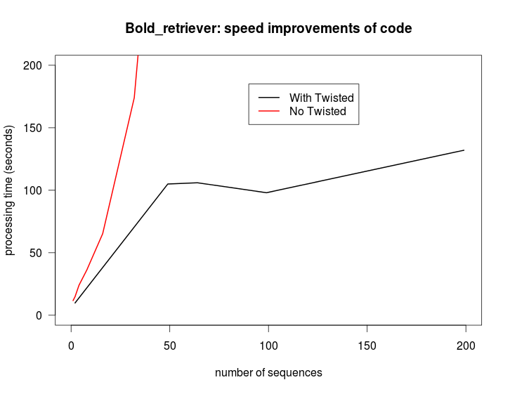

==============
Bold Retriever
==============

|Pypi index| |Build Status| |Cover alls| |Dependencies status| |Download numbers|

This script accepts FASTA files containing COI sequences. It queries the BOLD
database http://boldsystems.org/ in order to get the taxa identification
based on the sequences.
 
Run this way
------------
* clone repository::

    cd $USERAPPL
    git clone https://github.com/carlosp420/bold_retriever.git

* install dependencies (python2.7)::

    cd bold_retriever
    module load biopython-env
    pip install -r requirements.txt

* run software

You have to choose one of the databases available from BOLD
http://www.boldsystems.org/index.php/resources/api?type=idengine
and enter it as argument:

* COX1_SPECIES
* COX1
* COX1_SPECIES_PUBLIC
* COX1_L640bp

For example::

    python bold_retriever.py -f ZA2013-0565.fasta -db COX1_SPECIES

* output::

    seq_id  bold_id       similarity  division  class       order       family        species                collection_country
    OTU_99  FBNE064-11    1           animal    Insecta     Neuroptera  Hemerobiidae  Hemerobius pini        Germany
    OTU_99  NEUFI079-11   1           animal    Insecta     Neuroptera  Hemerobiidae  Hemerobius pini        Finland
    OTU_99  FBNE172-13    0.9937      animal    Insecta     Neuroptera  Hemerobiidae  Hemerobius atrifrons   Germany
    OTU_99  FBNE162-13    0.9936      animal    Insecta     Neuroptera  Hemerobiidae  Hemerobius contumax    Austria
    OTU_99  TTSOW138-09   0.9811      animal    Insecta     Neuroptera  Hemerobiidae  Hemerobius ovalis      Canada
    OTU_99  CNPAH380-13   0.9811      animal    Insecta     Neuroptera  Hemerobiidae  Hemerobius             Canada
    OTU_99  CNKOF1602-14  0.9811      animal    Insecta     Neuroptera  Hemerobiidae  Hemerobius pinidumus   Canada
    OTU_99  NRAS173-11    0.9748      animal    Insecta     Neuroptera  Hemerobiidae  Hemerobius conjunctus  Canada
    OTU_99  SSBAE2911-13  0.9748      animal    Collembola  None        None          Collembola             Canada
    OTU_99  CNPAQ117-13   0.9686      animal    Insecta     Neuroptera  Hemerobiidae  Hemerobius humulinus   Canada

Speed
-----
**bold_retriever** uses the library Twisted for performing asynchronous calls.
This speeds up the total processing time:

|benchmarks|

Full documentation
------------------
See the full documentation at http://bold-retriever.readthedocs.org

.. |Pypi index| image:: https://badge.fury.io/py/bold_retriever.svg
   :target: http://badge.fury.io/py/bold_retriever
.. |Build Status| image:: https://travis-ci.org/carlosp420/bold_retriever.png?branch=master
   :target: https://travis-ci.org/carlosp420/bold_retriever
.. |Cover alls| image:: https://img.shields.io/coveralls/carlosp420/bold_retriever.svg
   :target: https://coveralls.io/r/carlosp420/bold_retriever?branch=master
.. |Dependencies status| image:: https://gemnasium.com/carlosp420/bold_retriever.svg
   :target: https://gemnasium.com/carlosp420/bold_retriever
.. |Download numbers| image:: https://pypip.in/download/bold_retriever/badge.svg
   :target: https://crate.io/packages/bold_retriever
   :alt: Downloads

